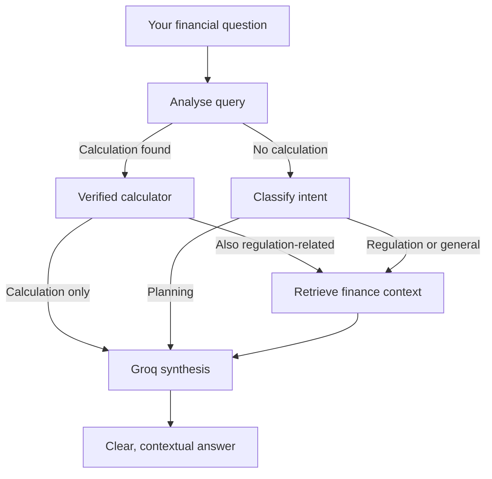

# FinanceAI — your financial co-pilot, with receipts

[](https://www.python.org/)
[](https://fastapi.tiangolo.com/)
[](https://groq.com/)
[](https://app.netlify.com/projects/clinquant-kringle-78de32/agent-runs/6a6b440e3bf81a436a4d19a4)

FinanceAI is a focused financial assistant that routes a question through the right tool instead of treating every request like ordinary chat. Calculate an EMI, ask about regulations, plan a budget, or combine them in one prompt—and see the route used to create the answer.

> **Live deployment:** Managed with [Netlify](https://app.netlify.com/projects/clinquant-kringle-78de32/agent-runs/6a6b440e3bf81a436a4d19a4). Add the public `*.netlify.app` URL here when it is available.

## Explore

- [What makes it different](#what-makes-it-different)
- [Try these prompts](#try-these-prompts)
- [How the agent thinks](#how-the-agent-thinks)
- [Features](#features)
- [Run it locally](#run-it-locally)
- [API quick reference](#api-quick-reference)
- [Project map](#project-map)
- [Important notes](#important-notes)

## What makes it different

Most chatbots produce an answer in one step. FinanceAI uses a small routing graph to choose an appropriate path:

- **Deterministic calculators** handle EMI, simple interest, and compound interest—no LLM arithmetic guesswork.
- **Regulation-aware answers** can retrieve relevant passages from the local financial knowledge base.
- **Planning guidance** uses Groq for clear, structured next steps without stock-price predictions.
- **Combined questions work.** Ask for an EMI calculation *and* an RBI-related explanation in the same message; the agent can calculate first, retrieve context second, and then synthesize one answer.
- **The interface is built for exploration:** authentication, calculator modals, chat history, a light/dark theme, and an optional debug route for inspecting the agent state.

## Try these prompts

After creating an account, copy one of these into the chat:

| Goal | Prompt to try |
| --- | --- |
| Calculate a loan payment | `Calculate the EMI for a ₹500,000 loan at 8% for 5 years.` |
| Compare interest growth | `What is the compound interest on ₹100,000 at 7% for 3 years?` |
| Build a saving habit | `I earn ₹60,000 monthly. Help me create a practical budget and emergency-fund plan.` |
| Mix tools and research | `Calculate EMI for ₹500,000 at 8% for 5 years, and explain whether this kind of lending is regulated by RBI.` |
| Explore a regulation | `What do the knowledge-base documents say about digital lending safeguards?` |

## How the agent thinks



## Features

| Area | Included |
| --- | --- |
| AI | Groq-powered financial planning and explanation layer |
| Agent routing | LangGraph workflow for calculation, retrieval, and synthesis |
| Financial tools | EMI, simple-interest, and compound-interest calculators |
| Knowledge base | Local PDFs plus a FAISS vector index for financial and regulatory context |
| Accounts | Signup/login with bcrypt password hashing and JWT bearer authentication |
| Memory | Per-user in-memory chat history with a clear-history action |
| Frontend | Responsive single-page interface, theme switcher, quick prompts, and calculator panels |
| Diagnostics | `/ask-debug` exposes the selected agent path and tool data for demos and development |

## Run it locally

### 1. Prerequisites

- Python 3.11 or newer
- A [Groq API key](https://console.groq.com/keys)

### 2. Configure and start

```powershell
cd Backend
py -m venv finance_env
.\finance_env\Scripts\Activate.ps1
pip install -r requirements.txt
Copy-Item .env.example .env
```

Add your key to `Backend/.env`:

```env
GROQ_API_KEY=your_groq_api_key
# Optional; this is the default model
GROQ_MODEL=llama-3.3-70b-versatile
```

Then start the application:

```powershell
uvicorn app.main:app --host 127.0.0.1 --port 8000
```

Visit **http://localhost:8000** and create an account to start chatting.

<details>
<summary><strong>Using a separately hosted frontend?</strong></summary>

Set `API_BASE_URL` in `frontend/config.js` to the public URL of your FastAPI backend. The frontend is also served by the backend when running locally.

</details>

## API quick reference

| Method | Endpoint | Purpose | Auth |
| --- | --- | --- | --- |
| `GET` | `/health` | Lightweight service check | No |
| `POST` | `/signup` | Create an account | No |
| `POST` | `/login` | Receive a bearer token | No |
| `POST` | `/ask` | Ask FinanceAI a question | Yes |
| `POST` | `/ask-debug` | Inspect the agent route and tool output | Yes |
| `POST` | `/tools/emi` | Calculate an EMI | Yes |
| `POST` | `/tools/simple-interest` | Calculate simple interest | Yes |
| `POST` | `/tools/compound-interest` | Calculate compound interest | Yes |
| `GET` | `/history` | Read your chat history | Yes |
| `POST` | `/clear-session` | Clear your chat history | Yes |

Interactive API documentation is available at **http://localhost:8000/docs** while the backend is running.

## Project map

```text
FinanceAI/
├── frontend/                 # Single-page chat experience
├── Backend/
│   ├── app/
│   │   ├── agent/            # LangGraph routing, tools, and state
│   │   ├── auth/             # JWT and password helpers
│   │   ├── rag/              # Embeddings, FAISS, and retrieval
│   │   ├── services/         # Groq, memory, intent, calculator services
│   │   └── main.py           # FastAPI routes and frontend serving
│   ├── knowledge_base/       # Finance and regulation source documents
│   ├── finance_index/        # Prebuilt FAISS index
│   ├── .env.example          # Safe configuration template
│   └── requirements.txt
└── README.md
```

## Important notes

- FinanceAI is an educational assistant, **not** a substitute for a licensed financial adviser, tax professional, or legal counsel.
- Never commit `Backend/.env`; it contains your Groq credential.
- Chat history is currently stored in memory, so it resets when the backend restarts.
- The first RAG request may need to download the `all-MiniLM-L6-v2` embedding model. If it is unavailable, the app continues to serve calculator and Groq-powered planning responses.

---

If FinanceAI helps you explore a decision more clearly, consider starring the repository. ★
